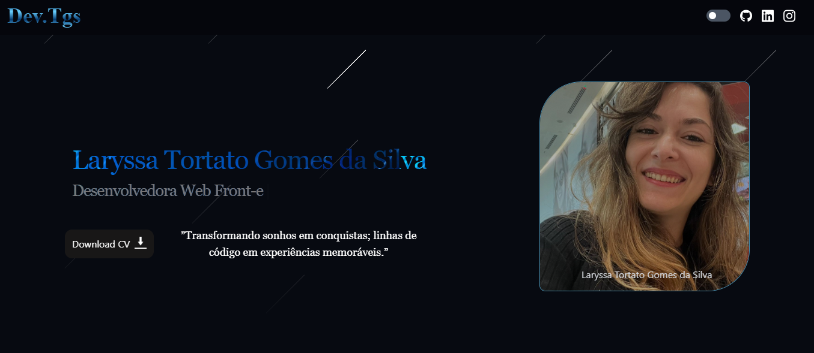

# Meu portifólio Oficial

🚀 Tenho o prazer de apresentar a segunda versão do meu portfólio profissional, agora desenvolvida com React.

Após iniciar minha trajetória com um portfólio construído em HTML e CSS puro, senti a necessidade de evoluir tecnicamente e aplicar novos conhecimentos adquiridos ao longo dos meus estudos. Essa nova versão marca uma etapa importante, refletindo minha dedicação ao aprimoramento contínuo como desenvolvedora Front-end.

🛠 O que contém no projeto:

- HTML: Estrutura semântica para garantir acessibilidade e organização.
- CSS: Estilização moderna, com layouts fluidos e responsivos.
- React + Vite: Framework para componentização e construção rápida, garantindo performance otimizada.
- Tailwind CSS: Estilização ágil e consistente, com design utilitário para maior produtividade.

🛠 O que esta versão já contempla:

- Estrutura Responsiva: Layouts que se adaptam perfeitamente a diferentes dispositivos, desde smartphones até desktops.
- Design Limpo e Intuitivo: Foco em usabilidade, com navegação clara e visual atraente para destacar habilidades e experiências.
- Fundo com Estrelas Cadentes: Uma animação de fundo dinâmica que adiciona um toque visual único e imersivo.
- Interações com Delay: Transições e animações suaves com delays cuidadosamente planejados para melhorar a experiência do usuário.
- Atualizações Mensais: Compromisso contínuo com a evolução do projeto, incorporando novas funcionalidades, otimizações de desempenho e melhorias no design.

🚀 O que está por vir

- Novas Funcionalidades: Planejamento de seções interativas, como um blog integrado ou uma galeria de projetos com filtros dinâmicos.
- Otimização de Performance: Melhorias no carregamento de assets e redução do tempo de renderização.
- Acessibilidade: Implementação de padrões ARIA para tornar o portfólio ainda mais inclusivo.
- Integração com Backend: Exploração de APIs para funcionalidades dinâmicas, como formulários de contato ou integração com plataformas de terceiros.

📬 Convido você a visitar e, se possível, compartilhar sua opinião:
👉 https://lnkd.in/g4Mx9m7A

</img>
